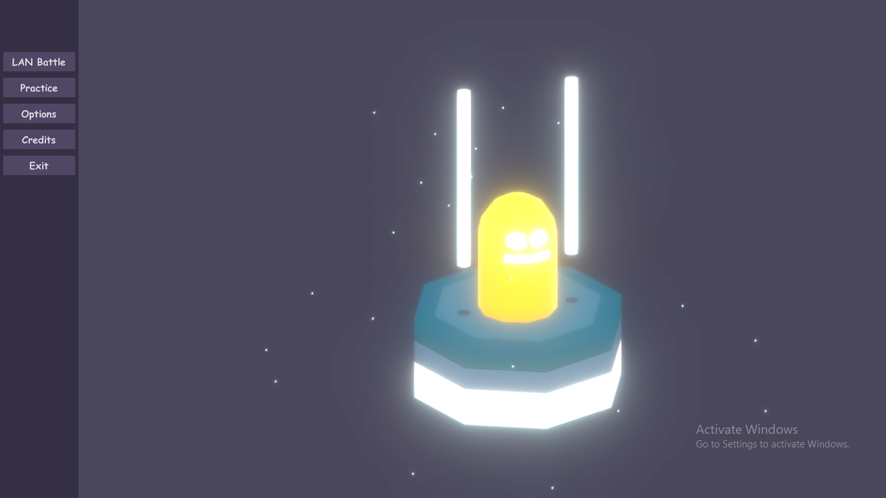

# PocketWarriors

Watch Gameplay video !

## Project Idea
A LAN multiplayer fighting prototype made with UNet. It's open source project and build can be found [here](https://amirihusayn.itch.io/pocketwarriors).

## Contributing
Any contributions are welcome. Take a look at .

## About art and animations
Consider that I'm not artist but I also made all art and animations of this game using Blender. Now we need contribution on art section.

## To Do
There are several milestones that you can check out them and contibute for solving issues.  
- [ ] Art
- [ ] Profile System
- [ ] Initial Combat Gameplay System
- [ ] Networking
- [ ] UI
- [ ] Bonus Combat gameplay system

## Thanks
  Unlimited thanks to God   
  Special thanks to my master [Dr.Mir Saman Tajbakhsh](https://mstajbakhsh.ir/)   
  hope you enjoy 🤗🌹  

>:blossom:Imam Mahdi(As) declared :
> we are aware of all your news 
> and none of your actions is hidden from us.
